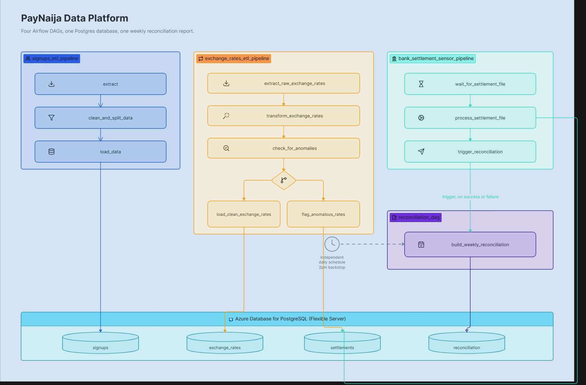
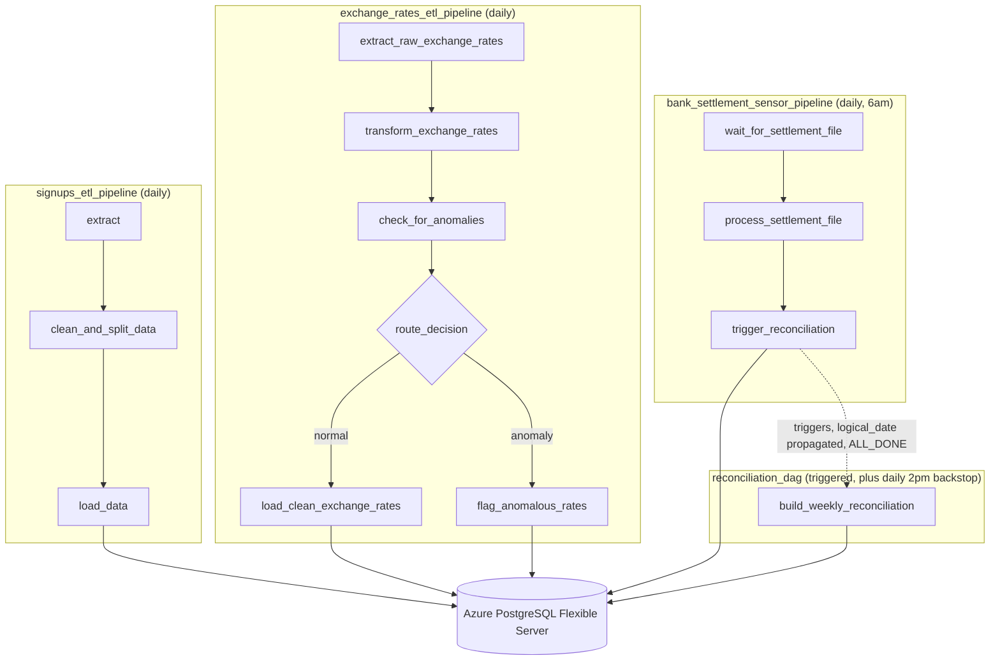
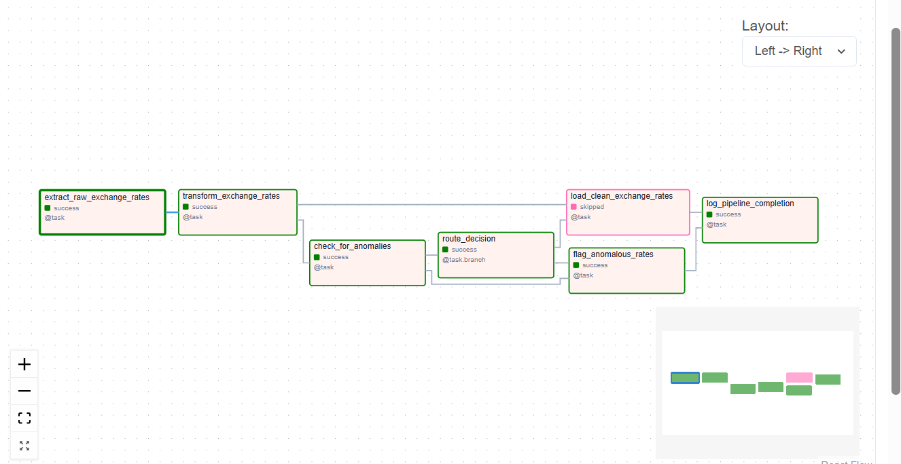
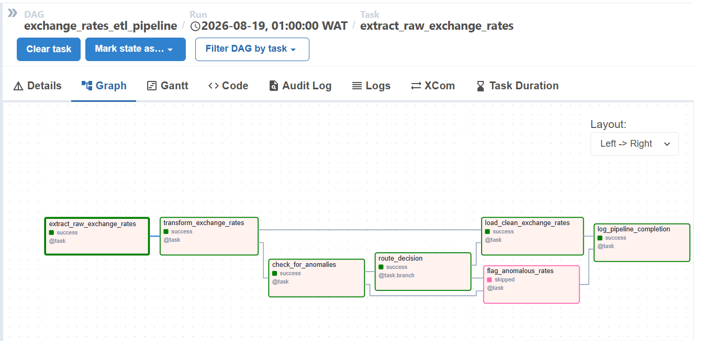
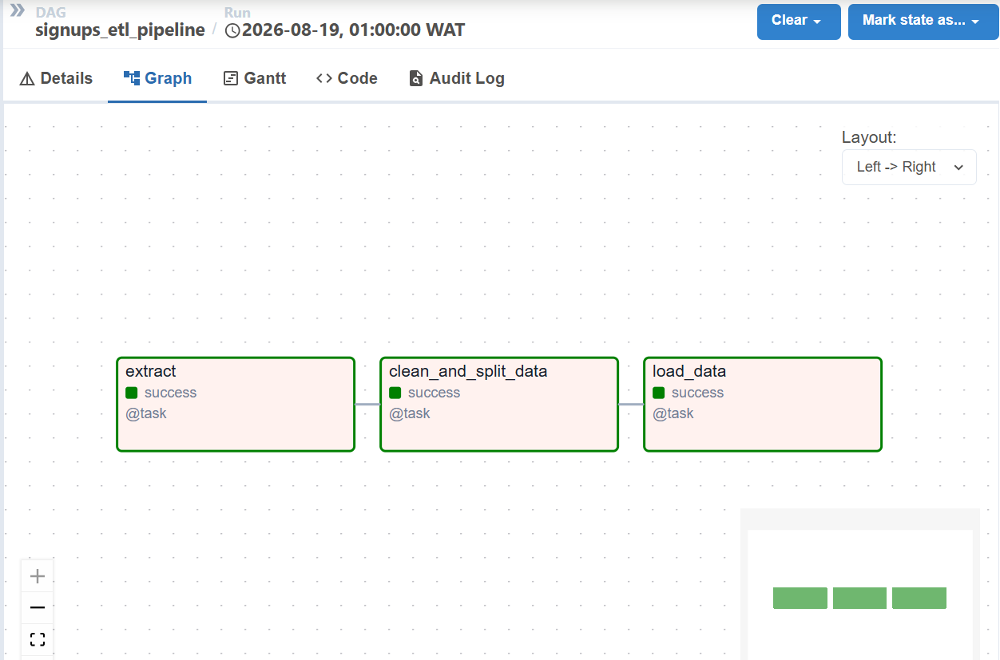
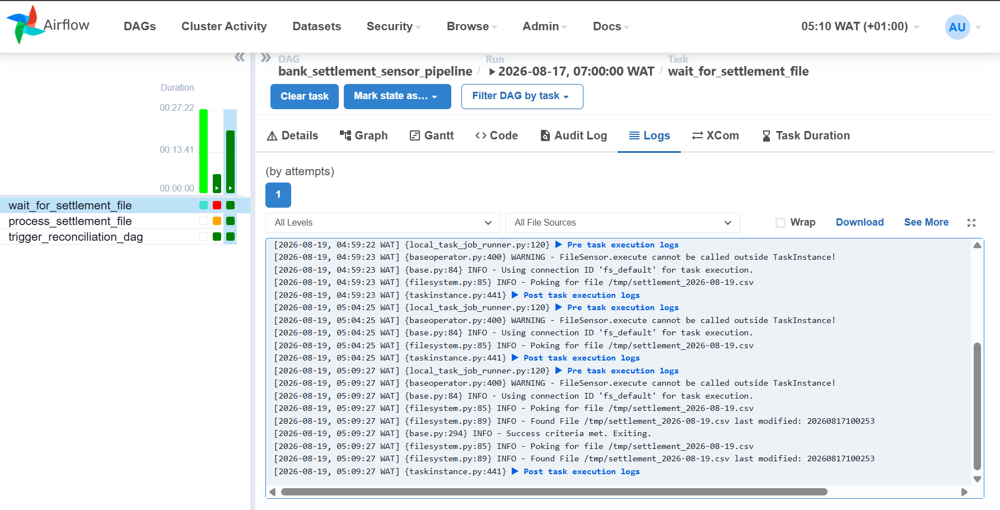

# PayNaija Data Platform

Four Apache Airflow DAGs built, using a fictional Nigerian fintech, PayNaija, as the business backdrop. Each DAG started as a business problem, went through a design review before any code was written, and got debugged against a Postgres database.

Full business requirements for all eight projects that built this system: [`docs/business-requirements.pdf`](docs/business-requirements.pdf). Full design reasoning and debugging notes: [`docs/design-decisions.md`](docs/design-decisions.md).



## Table of contents

- [What this is](#what-this-is)
- [Architecture](#architecture)
- [The four pipelines](#the-four-pipelines)
- [Tech stack](#tech-stack)
- [Repository structure](#repository-structure)
- [Running this locally](#running-this-locally)
- [Running against Azure Postgres](#running-against-azure-postgres)
- [Screenshots](#screenshots)

## What this is

PayNaija needed daily customer signups loaded into a reporting table, daily exchange rates for finance, a way to wait for a bank settlement file that arrives at an unpredictable time each morning, and a weekly reconciliation report tying all three together. Each of those became its own DAG, built one at a time, with the difficulty increasing project by project.

The point of this project was not to practice Airflow syntax. It was to think through the questions a data engineer actually faces: what happens on retry, what happens when a value is missing, what happens when two runs overlap, and what happens when something upstream fails outright.

## Architecture



`signups_etl_pipeline` and `exchange_rates_etl_pipeline` run independently on their own daily schedules. `bank_settlement_sensor_pipeline` waits for a file, then triggers `reconciliation_dag` directly. `reconciliation_dag` also has its own independent daily schedule as a backstop, so it never depends entirely on another DAG's health to run. The full reasoning behind that dual-trigger design is in [`docs/design-decisions.md`](docs/design-decisions.md).

## The four pipelines

### signups_etl_pipeline

| | |
|---|---|
| Schedule | `@daily` |
| Source | `signups.csv` (path in an Airflow Variable) |
| Destination | `customer_signups` (Postgres) |
| Pattern | Run-scoped staging table, `ON CONFLICT (signup_id) DO NOTHING` |
| Key concerns | Leading-zero ID preservation, rejected-row auditability, per-task retry tuning |

Reads a daily signups CSV, separates valid rows from invalid ones, and loads the valid rows into Postgres. Tasks: `extract`, `clean_and_split_data`, `load_data`.

Rejected rows never disappear. Missing `signup_id`, missing `email`, and duplicate rows all land in `rejected_signups.csv` with a `rejection_reason` column. `signup_id` is read as a string at every point this pipeline touches a CSV, so a value like `00123` is never silently coerced into `123`. Retries are tuned per task: `extract` and `clean_and_split_data` fail fast, since their failures are deterministic, while `load_data` retries with exponential backoff, since its failures are usually a transient database issue.

Full reasoning: [design-decisions.md § signups_etl_pipeline](docs/design-decisions.md#signups_etl_pipeline).

### exchange_rates_etl_pipeline

| | |
|---|---|
| Schedule | `@daily` |
| Source | Public FX API (NGN, GHS, KES against USD) |
| Destination | `clean_exchange_rates` or `flagged_exchange_rates`, branch-dependent |
| Pattern | Bronze/silver (append-only raw audit log, upserted clean table), branching on an anomaly threshold |
| Key concerns | Race-safe raw lookup by row id, cold-start handling, missing-currency tolerance |

Pulls daily exchange rates and prepares them for finance reporting. Tasks: `extract_raw_exchange_rates`, `transform_exchange_rates`, `check_for_anomalies`, `route_decision`, then either `load_clean_exchange_rates` or `flag_anomalous_rates`.

`raw_exchange_rates` is append only, so any historical API response can be inspected later. A missing currency is a warning, not a hard failure, the pipeline loads what it has. Any currency whose rate swings more than `ANOMALY_THRESHOLD_PERCENTAGE` (an Airflow Variable, 15 percent by default) routes the whole run to `flagged_exchange_rates` instead of production, with a direct notification fired from inside that task.

Full reasoning: [design-decisions.md § exchange_rates_etl_pipeline](docs/design-decisions.md#exchange_rates_etl_pipeline).

### bank_settlement_sensor_pipeline

| | |
|---|---|
| Schedule | Daily, 6:00 AM |
| Source | Settlement file dropped by Treasury Ops, arrival time unpredictable |
| Destination | `processed_settlement_files` (audit), plus triggers `reconciliation_dag` |
| Pattern | `FileSensor` in `reschedule` mode, cross-DAG trigger |
| Key concerns | Worker-slot cost of long waits, exact-path Jinja templating, `logical_date` propagation |

Waits for a file that historically lands anywhere from 6am to past 11am, sometimes not at all. Tasks: `wait_for_settlement_file`, `process_settlement_file`, `trigger_reconciliation`.

The sensor polls every five minutes without holding a worker slot the whole time, gives up after seven hours, and fails loudly rather than silently skipping. `trigger_reconciliation` fires on `TriggerRule.ALL_DONE`, so a missing file still reaches reconciliation the same day, and it explicitly passes `logical_date` forward, since Airflow does not do that automatically.

Full reasoning: [design-decisions.md § bank_settlement_sensor_pipeline](docs/design-decisions.md#bank_settlement_sensor_pipeline).

### reconciliation_dag

| | |
|---|---|
| Schedule | Triggered (`ALL_DONE`) plus an independent daily 2:00 PM backstop |
| Source | `customer_signups`, `clean_exchange_rates`, `flagged_exchange_rates`, `processed_settlement_files` |
| Destination | `weekly_reconciliation_reports` |
| Pattern | Date-backbone aggregation query, idempotent weekly upsert, dual-trigger resilience |
| Key concerns | Honest gap reporting mid-week, foreign-key-safe table bootstrap, resilience to total upstream failure |

Builds the weekly reconciliation report. Single task: `build_weekly_reconciliation`.

The report status is not binary, it can be `IN_PROGRESS`, `IN_PROGRESS_WITH_GAPS`, `IN_PROGRESS_WITH_ANOMALIES`, `PENDING_AUDIT_GAPS`, `PENDING_FX_REVIEW`, or `FINAL`, and gaps or anomalies surface as soon as they are detected rather than waiting for the week to close. Because this DAG queries four tables it does not own, it also bootstraps all four if they do not exist, in an order that respects the foreign key from the clean and flagged FX tables back to the raw one.

Full reasoning: [design-decisions.md § reconciliation_dag](docs/design-decisions.md#reconciliation_dag).

## Tech stack

Apache Airflow (TaskFlow API), Python (pandas, numpy, requests, psycopg2), PostgreSQL (Azure Database for PostgreSQL, Flexible Server, in production use; any Postgres 13+ works for local development).

## Repository structure

```
paynaija-data-platform/
├── dags/
│   ├── signups_etl_pipeline.py
│   ├── exchange_rate_pipeline.py
│   ├── bank_settlement_pipeline.py
│   ├── reconciliation_dag.py
│   └── utils.py            # shared notify_failure callback, excluded from DAG parsing via .airflowignore
├── docs/
│   ├── architecture-diagram.png
│   ├── design-decisions.md
│   ├── business-requirements.pdf
│   └── screenshots/
├── data/
│   ├── signups.csv
│   └── settlement_sample.csv
├── .airflowignore
├── requirements.txt
├── .gitignore
└── README.md
```

`utils.py` sits in `dags/` because it needs to be importable from every DAG file with a plain `from utils import notify_failure`, but it has no `@dag` decorator, so it produces nothing for Airflow's scheduler to run. It is listed in `.airflowignore` so the scheduler does not waste time parsing it on every cycle.

## Running this locally

1. Install Postgres locally, or run it in a container, and create a database.

2. Install Airflow and start it:

   ```bash
   pip install "apache-airflow[postgres]==3.0.2" --constraint <the constraint URL for your Python version>
   airflow standalone
   ```

3. In the Airflow UI, add a Postgres connection with `conn_id = my_postgres_conn` pointing at your database. Credentials live in the Connection itself, never in code, and never committed to this repo.

4. Add the required Airflow Variables:

   ```text
   SIGNUPS_INPUT_PATH
   SIGNUPS_CLEAN_PATH
   SIGNUPS_REJECTED_PATH
   SETTLEMENT_FILE_DIR
   EXCHANGE_RATE_API_URL
   REQUIRED_CURRENCIES        (a JSON list, e.g. ["NGN", "GHS", "KES"])
   ANOMALY_THRESHOLD_PERCENTAGE
   ```

5. Drop `data/signups.csv` at the path your `SIGNUPS_INPUT_PATH` Variable points to, and rename `data/settlement_sample.csv` to match the Jinja-rendered settlement path for the day you are testing.

6. Trigger `signups_etl_pipeline` and `exchange_rates_etl_pipeline` first, since neither depends on anything else. Then `bank_settlement_sensor_pipeline`, which triggers `reconciliation_dag` once it succeeds.

## Running against Azure Postgres

The DAG code does not change at all between local and Azure. Only the Connection details behind `my_postgres_conn` change, and those details are stored in Airflow's own encrypted Connection store, not in this repository.

1. Provision an Azure Database for PostgreSQL Flexible Server. A burstable B2s tier is sufficient for this workload.
2. Add a firewall rule allowing your client IP, and keep SSL enforced.
3. In the Airflow UI, update the `my_postgres_conn` Connection:

   ```text
   Host:      <your-server-name>.postgres.database.azure.com
   Port:      5432
   Database:  <your-database-name>
   Login:     <your-admin-username>
   Password:  <your-admin-password>
   Extra:     {"sslmode": "require"}
   ```

4. Everything downstream, staging tables, upserts, foreign keys, works exactly as it does locally. No DAG file references a hostname, username, or password directly.

## Screenshots

### Exchange rate anomaly branch



Shows `check_for_anomalies` routing the run to `flag_anomalous_rates` while `load_clean_exchange_rates` is skipped.

### Normal exchange rate run



Shows the normal branch where the exchange rates pass validation and are loaded into `clean_exchange_rates`.

### Signups ETL pipeline



Successful end-to-end run of `signups_etl_pipeline`, with extraction, cleaning, and loading tasks completing successfully.

### Settlement file sensor



Shows the `FileSensor` polling for the settlement file, waiting through the first two checks, then detecting the file on the third check and allowing the pipeline to continue.